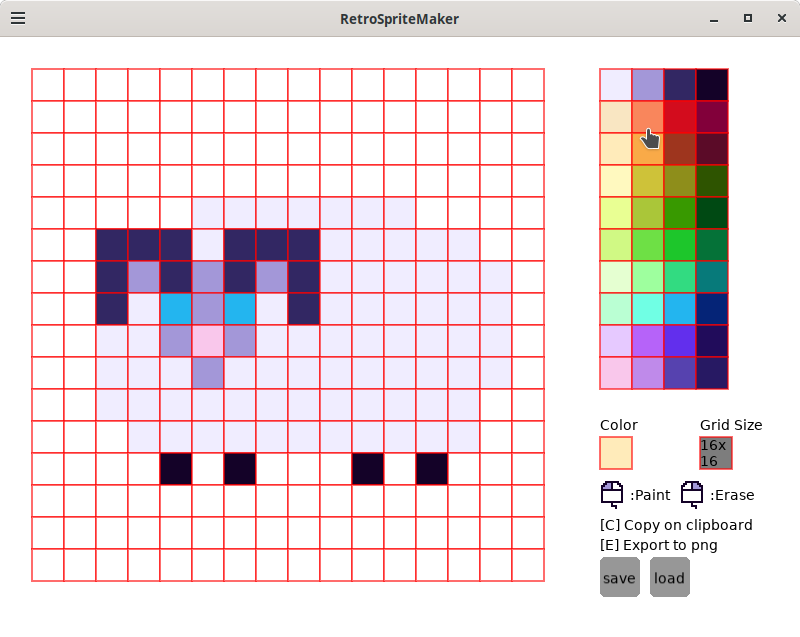

# RetroSpriteMaker

Created by **Jojopov**  
License: [GNU GPL v3](https://www.gnu.org/licenses/gpl-3.0.html)  
2025
{width=75%}

## Introduction

**RetroSpriteMaker** is a tool that will help you draw sprites the retro way.
Draw your sprite then copy the grid created — no image files involved!
This tool keeps only what's essential: the color data of the drawing.

## Materials required

- any code editor
- Linux or **Windows Vista and later**
- Love2D (for development or running the .love file)

## Application installation

### Linux

Simply run the project using:

<code>./RetroSpriteMaker/</code>
Or, if you already have the .love file:

 <code>RetroSpriteMaker.love</code>

### Windows

You can build a Windows executable using the provided build script.

## Build & Deployment

A script named <code>build.sh</code> is included at the root of the repository. It generates both the .love archive and a standalone Windows <code>.exe</code>.

### On Linux

<code>chmod +x build.sh
./build.sh</code>

This will:

Package the contents of <code>src/</code> into a <code>RetroSpriteMaker.love</code> archive

Concatenate it with the Windows version of <code>love.exe</code>

Copy necessary DLLs to <code>build/windows/</code>

Create a ready-to-distribute executable for Windows

💡 You need to download and extract the Love2D Windows (32-bit) binaries in <code>tools/love-win32/</code>.

### Running on Windows

Once built, your executable is located at:

<code>build/windows/RetroSpriteMaker.exe</code> 
It can be run directly **without installing Love2D**.